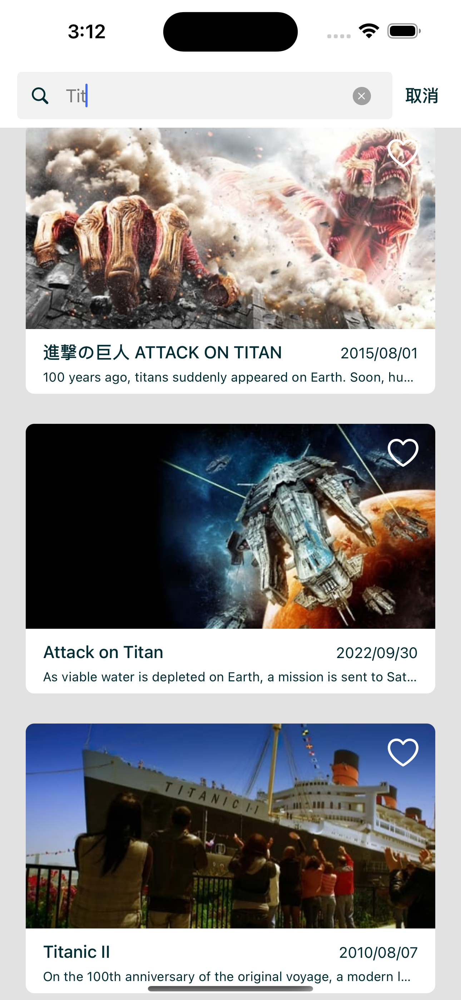

# Application


## How to use?

~~請先在 `Environment_DEV` & `Enviornment_PROD` 填寫 TMDB 的 Access Token
正常情況下不會採用這種方式來放置Token，現階段暫無製作登入取得Token的計畫，因此先採用此種方式來進行。~~

請透過 
```
/src/Application/Application.xcworkspace
```
來執行專案，本專案並無使用 `cocoapod` or `carthage` 等等的開發輔助工具，請正常的使用 `Xcode 14` 以上的版本進行開啟執行即可。


## Environment Intro

這是一個基礎的專案，可以用於快速建立一個專案的起始。
專案主程式放置於 

``` /src/Application ```

請先前往下述路徑有兩個 `xcconfig` ，分別提供 DEV & PROD 兩種環境變數，且會對應`Build scheme`做連動。

``` /src/Application/Application/Resources ``` 


---

本專案不使用 Storyboard 進行開發因此將相關設定移除，另外本專案也移除了`SceneDelegate`，如有需求可參考[網誌](https://medium.com/@jj2564/swift-紀錄-4-不使用storyboard開發的專案設定-d6c654db1cab)進行添加。

順便建置了我一直想要做的基礎專案設定
最終希望能夠把相關的 `framework` 都製成 `SwfitPackage` 這樣就能大幅縮短初始專案建置的時間。
應該也能節省編譯的時間。

---

在  `Application.workspace` 中我們可以看到有
> 01.Application
>> 用來放置與此 App 有關的 `Domain` 
>  
> 02.Infrastructure
>> 用來放通用型的服務，如 `HttpClient`、`DataStorage`、`Logging`、`Identity`、`Security` 或是專案的 `Configuration`，不過還在思考與建製中，雖然目前工作上有在使用，但是並不是我個人期望的最終版本。


## Unit Test

在這個專案的設計架構上，是可以透過創造譬如說 `Infrastructure.HttpClient.Mock` 的 FrameWork 來協助專案進行測試(也可以讓開發可以讀取 Mock )，具體上必須打造一個 `Unit Test` 用的流程，不過這部分需要透過修改 `Hosting` 的邏輯才能辦到，目前尚未把這環節設計完全，因此本專案的 `Unit Test` 仍會採用創建同等的 Mock 來進行。


## TMDB Application Intro

圖片icon來自於[網路素材](https://iconscout.com/icon/the-movie-database-3627833)，採 1024x1024px 的 single size 。

同常完整的專案我會再建立一個 `Application.Core` 在 `01.Application` 用來放置專屬於這個 App 的相關設定，可能根據環境變化的網址(ex. DEV, STAGE, PROD)，或是一些引導 `ContextFactory` 的設置，但本專案功能較侷限因此採較迅速可以建立專案的方式來進行。

不過因為 `TMDB` 本身並沒有測試機，所以兩個 `Target` 除了名稱不一樣外操作上沒什麼區別。

設計上並沒有實作 `Setting` 的頁面，我認為這些功能可以巧妙的融入一般頁面之中，再透過 `UserDefault` 紀錄設定參數就能達到同樣的效果

### Demo


  

  



### Login

TMDB需要透過 `token` 才能取得資料，但為了保護資料不應該將其存在程式碼之中，因此設計一個登入讓使用者輸入自己的 `token` ，其實邏輯上有一點打架因為其實一般使用者應該是透過開發者的 `token` 來觀賞資料，但是這邊要求的是輸入開發者的。

透過 

```
https://api.themoviedb.org/3/authentication
```
驗證為有效的 `token` 之後會透過 `AccessKeychain` 進行資料的保護，之後的使用也會自動從中取出資料驗證，達到自動登入的效果。


### NowPlaying

會去偵測即將滑到底部的時候會去呼叫更多的資料回來實現可以一直瀏覽的效果，理應要加一個loading在footer，受限於時間先空下這塊。

MovieCardView的部分，沒有完全展現Summary，希望能讓使用者點選進去看詳細內容。

本頁面沒有製作讀取中的框架，因本頁尚未確定資料狀態我認為較不適合，再之後的`我的收藏`因資料庫中已儲存已知數量的movieId，故可先製成框架。

在這邊圖片會取比較小的 w500。


### MovieDetail

分析發現 `MovieDetail` 跟 `Movie` 本身只有欄位多寡的問題，所以直接統一用同一個結構去接資料，如果沒有的資料就是讓他 `nil` 就好。
前一頁會把已經有的資料傳送到下一頁，所以會有default的資料，等到拿回詳細資料之後再把資訊補齊

在這頁會取 origin 的圖片

### SearchMovie

這邊就是很單純的接了搜尋的api


### FavoriteList

透過 `Realm` 的資料庫來存使用者的收藏列表，後來覺得可以讓每個地方都可以進行收藏與取消收藏。
將收藏功能都整理到 `ToggleFavorButton` ，並在裡面透過 `Notification` 實作在下層的收藏可以通知到上層的頁面。

~~為了避免一口氣呼叫太多api，在收藏的階段並不會一口氣拿回所有的電影資料，有可能會導致被 `TMDB` 封鎖，採畫面呈現後再去讀取詳細的資料。
本頁面會根據資料庫內的數量先呈現基本的框架，等待資料齊全之後再進行畫面更新。
本來在這個頁面有做了排序的功能，但因為上述設計會導致後來娶的資料並未納入排序，故在此關閉此功能。~~

為了排序直接在收藏的時候把movie的資料一起塞進db了，不過這樣會產生收藏的資料並不會是最新的資料，那可能會造成排序上的差異問題， `MovieCard` 仍然保留了更新資料的方法，有時間再想怎麼解決這個問題。
排序上這邊做了一個小的策略模式，可以方便之後擴增排序的方法。


### Movie Images

原本的 Movie 就有包含圖片資訊，套用了 `Kingfisher` 的套件，那會在如果原本的圖片沒有取到圖片的話就會去 call 這隻 api ，並採用第二張圖片嘗試呈現，如果第二張圖片持續失敗就不會再嘗試了。


### TODO

- [x] 排序設定要儲存起來
- [ ] 收藏排序資料時效問題
- [ ] 不同排版，要再多套一個CollectionView

